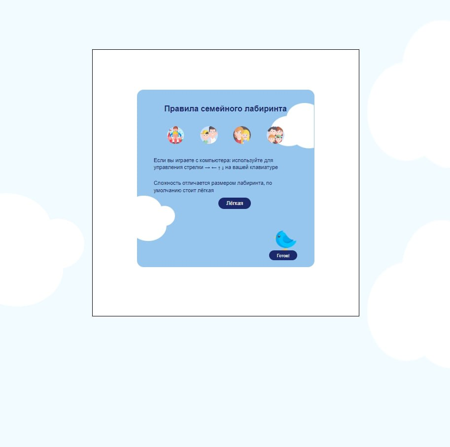
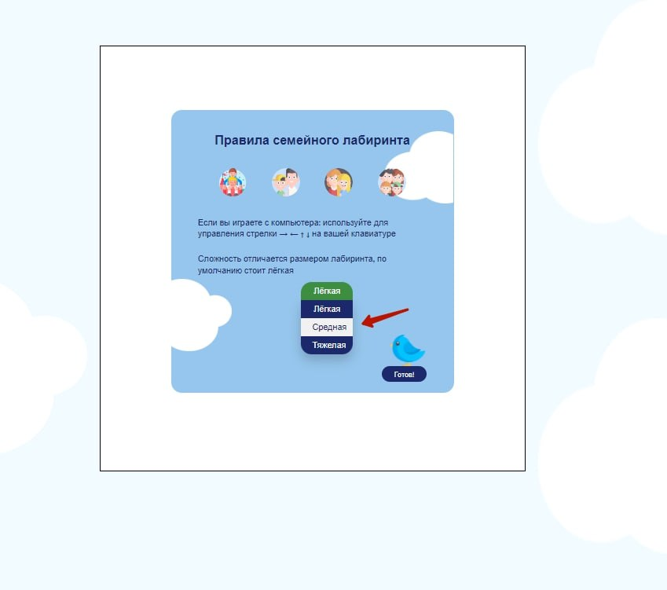
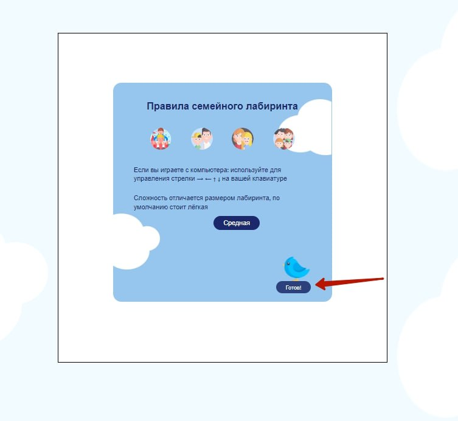
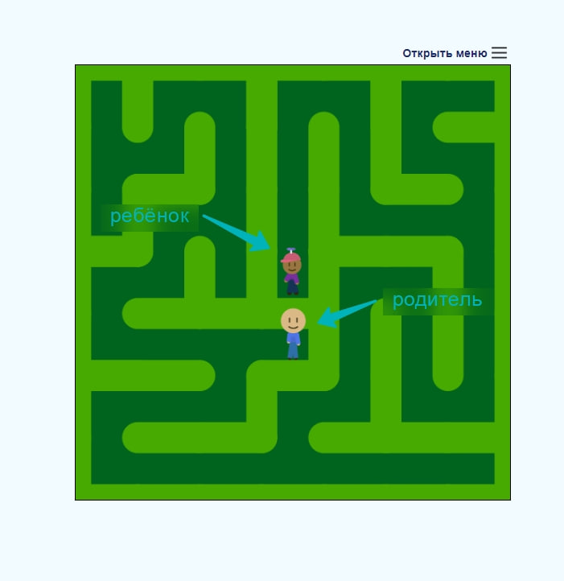
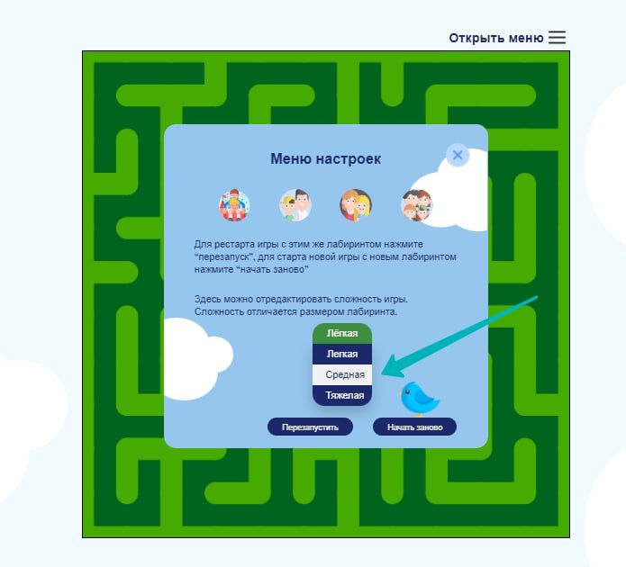
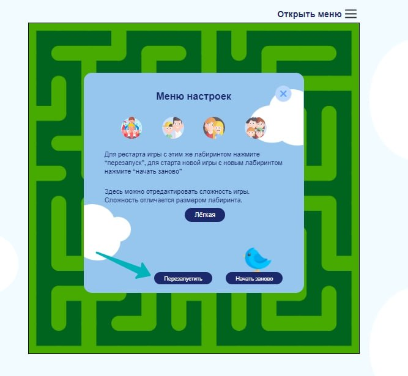
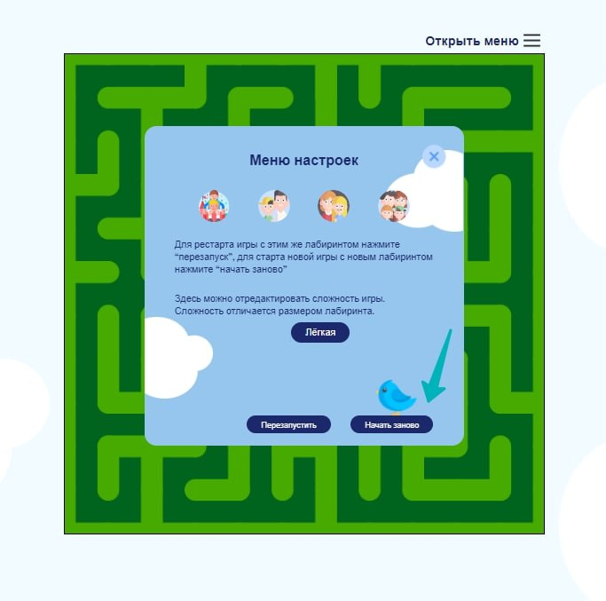
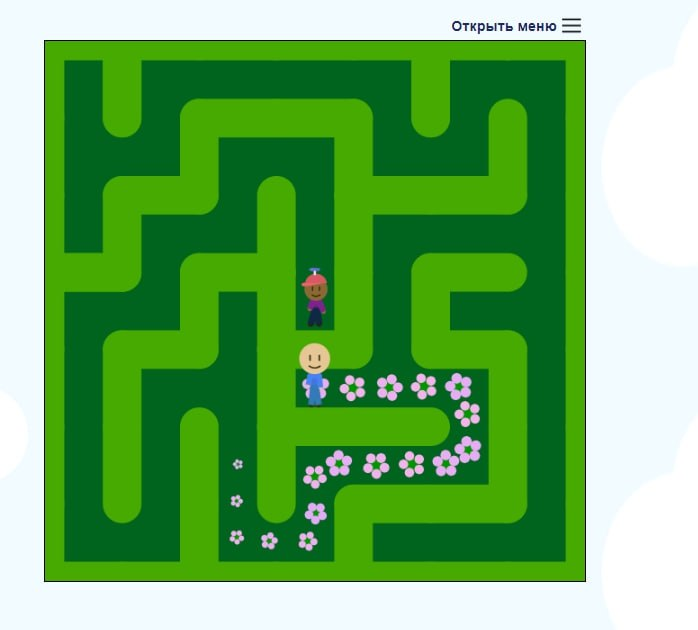
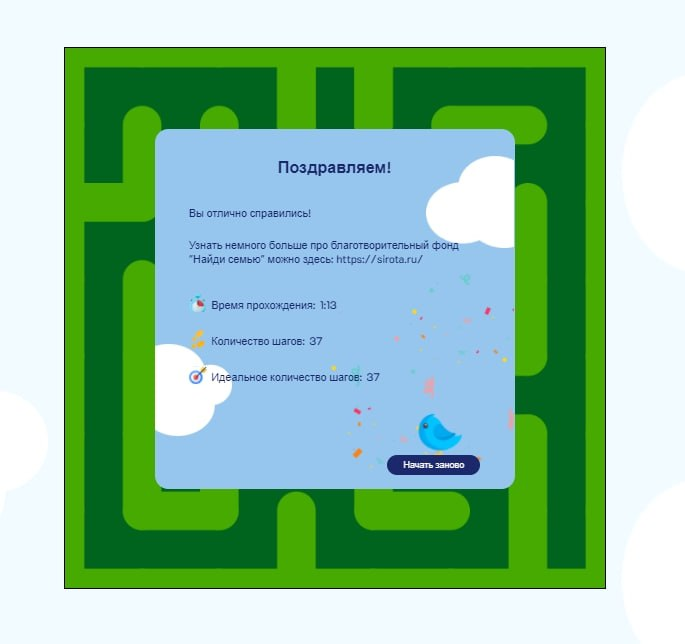
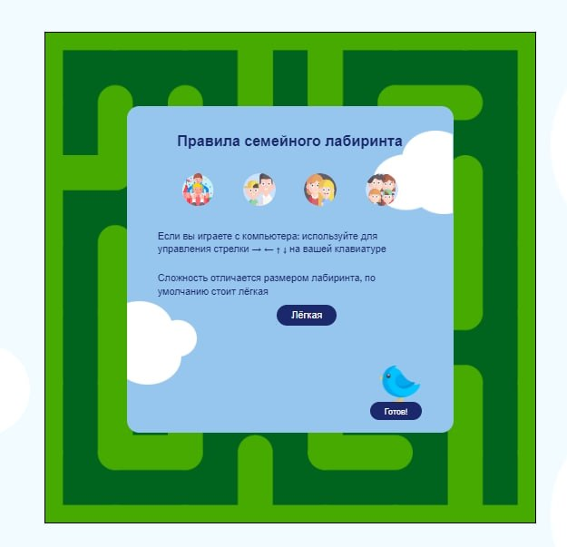

## Hackaton team #1

### Members
- [Матвей](https://t.me/bgmdmt)
- [Алёна](https://t.me/alysaf)
- [Олег (слегка)](https://t.me/freedastro)

### Описание проекта

#### Стек проекта
- HTML 
- CSS
- Canvas
- P5JS
- JavaScript

#### Концепция
Наша команда реализовала игру "Семейный лабиринт". Здесь старт и финиш не на привычных точках, а в центе. Так мы хотели показать, что в самом начале, кажется, что взять в семью ребенка - это легко (поэтому родитель и ребенок генерируются близко, почти в центре), но на самом деле это не такая простая задача - найти путь к сердцу ребенка и стать членом его семьи. Его появление в семье - радостное событие, поэтому в конце игры путь до ребенка становится цветочной тропой.  
#### Какие фичи реализованы

- генерация рандомных лабиринтов на каждую игру;
- инструкция к игре (как в нее играть);
- управление "родителем" с клавиатуры стрелочками;
- реализован алгоритм самой игры: "родитель" не может проходить сквозь стены лабиринта;
- возможность сбросить игру к начальному значению (без потери конфигурации лабиринта);
- возможность "завершить" раунд и увидеть визуализацию правильного пути (дальше - рестарт партии с новым лабиринтом);
- экран поздравления с окончанием игры;

#### Дополнительные фичи из списка расширений
- возможность выбрать уровень сложности лабиринта (например, с варьирующимся размером);
- красивый дизайн и анимации(ЧЕЛОВЕЧКИ ДВИГАЮТ НОЖКАМИ УБЕДИТЕСЬ САМИ);
- статистика после прохождения, отражающая время количесво шагов и за сколько шагов можно было пройти игру; 

### Описание процесса игры со скриншотами
#### Старт
Главный экран игры: 

Выбор сложности: 

Старт игры: 

#### Процесс игры
Родитель и ребенок на старте: 

Можно поменять сложность даже после начала игры, если вы вдруг поняли, что вам сейчас слишком сложно: 

Можно перезапустить ту же самую игру в любой момент с тем же лабиринтом, если вы запутались: 

... или просто начать игру заново с генерацией нового лабиринта: 

перед перезапуском игры цветами выкладывается верный путь до ребенка: 

#### Конец игры
В конце игры при успешном прохождении Выводится поздравление, немного информации про НКО и статистика по прохождению⭐️: 

Тут также можно начать игру заново с новым сгенерированным лабиринтом. При нажатии на "нажать заново" вы снова попадаете на главный экран с возможностью выбора сложности и стартом игры: 

### Инструкция, как развернуть проект локально
Инструкция к нашему счастью делается на раз-два
- раз - клонируете
- два - запускаете index.html

Не нужно устанавливать NPM, ничего подтягивать, ничего править в конфигах, просто клонируете и играете.

### ВАЖНО 
Работа шла в репозитории https://github.com/SafAlyona/hackathon-team1 но в связи с часовыми поясами деплой делался в этом репозитории, чтобы мы могли точно проверить и все сделать. Так что так все и осталось. 

### Ссылка на деплой (см.ниже)

https://mattewkl.github.io/hackaton-team-1-backup
